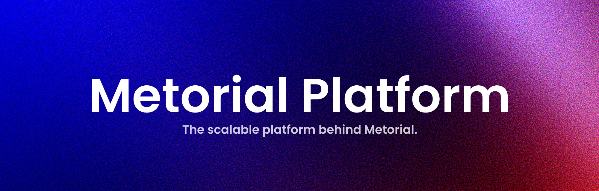

 

<h1 align="center">Metorial</h1>

The open source integration platform for agentic AI. 
Connect any AI model to thousands of APIs, data sources, and tools with a single function call.

Containerized versions of hundreds of <a href="https://modelcontextprotocol.io">MCP servers</a> 📡 🧠

 

> [!TIP]
> *Skip the setup and go hosted:* The fasted, simplest and most reliable way to use [Metorial](https://metorial.com) is to sign up for [early access to our hosted platform](https://metorial.com/early-access).
> 
> ➡️ **[Get Early Access (for free)](https://metorial.com/early-access)**

 

## Introduction

Metorial enables AI agent developers to easily connect their models to a wide range of APIs, data sources, and tools using the Model Context Protocol (MCP).
Metorial abstracts away the complexities of MCP and offers a simple, unified interface for developers, including powerful SDKs, detailed monitoring, and a highly customizable platform.

## SDKs

Metorial currently provides SDKs for the following languages:

*  [**JavaScript/TypeScript**](clients/metorial-js/sdk/metorial)
*  [**Python**](clients/metorial-py/sdk/metorial)

If you want to build a custom integration, check out our [API documentation](https://metorial.com/api) for details on how to use the Metorial API directly.

## Examples 

We have several example projects that demonstrate how to use Metorial with different AI models and tools.

* [Typescript + AI SDK](examples/typescript-ai-sdk) - Using Metorial with the [AI SDK](https://ai-sdk.dev/) in TypeScript.
* [Typescript + OpenAI](examples/typescript-openai) - Using Metorial with the [OpenAI API](https://platform.openai.com/docs/api-reference/introduction) in TypeScript.

## Motivation

MCP is a powerful standard for connecting AI models to external data and tools, but it focuses on enabling AI clients (like Claude Desktop or Cursor) to connect to tools and data sources. 
Metorial builds on MCP but makes it a one-liner for developers to connect their AI apps to any API, data source, or tool.
Thereby we enable developers to create agentic AI applications that can interact with the world in simple, flexible, and powerful ways.

## Tech Stack

* [**Model Context Protocol (MCP)**](https://modelcontextprotocol.io) - Metorial is powered by the Model Context Protocol, a standard for connecting AI models to external data and tools.
* [**Docker**](https://www.docker.com) - Metorial uses Docker to run MCP servers in a containerized environment, making it easy to deploy and manage.
* [**MCP Containers**](https://github.com/metorial/mcp-containers) - Metorial provides a collection of pre-built MCP servers in Docker containers.
* [**Typescript**](https://www.typescriptlang.org) - Most of Metorial is written in TypeScript.
* [**Bun**](https://bun.sh) - The core of Metorial runs on Bun, a fast JavaScript runtime that is compatible with Node.js.
* [**Go**](https://go.dev) - The MCP engine is written in Go, providing a high-performance backend for Metorial.
* [**PostgreSQL**](https://www.postgresql.org) - Metorial uses PostgreSQL for data storage.
* [**Redis**](https://redis.io) - Metorial uses Redis for caching and real-time data processing.
* [**MongoDB**](https://www.mongodb.com) - Metorial uses MongoDB for storing usage data and logs.
* [**React**](https://reactjs.org) - The Metorial Dashboard is built with React.

## Features

Metorial is built to make it super easy for developers to connect their AI apps to external data and tools. Powered by the Model Context Protocol (MCP), Metorial is built on standards.

### Key Features

* **✨ One-liner SDKs**: Connect your AI model to any API, data source, or tool with a single function call.
* **🛠️ Powered by MCP**: Metorial is built on the Model Context Protocol, a standard for connecting AI models to external data and tools.
* **🚀 Get started in minutes**: Metorial is designed to be easy to use, with a simple setup process and a unified interface for all your AI integrations.
* **🕊️ Open source**: Metorial is open source, so you can run it on your own infrastructure or use our hosted platform.
* **👩‍💻 Built for developers**: Metorial isn't built for end users, but for developers who need high quality tooling, monitoring, and customization options to build agentic AI applications.

### Large Server Catalog

The [Metorial server index](https://github.com/metorial/mcp-index) already contains more than 5000 MCP servers. It's a super easy to find and use MCP servers for your AI applications. Everything is searchable and neatly organized, so you can find the right server for your use case.

https://github.com/user-attachments/assets/a171030e-0159-4ce2-9e92-f4fb3f7bfdc6

### Embedded MCP Explorer

Test and explore MCP servers directly in the Metorial Dashboard. The embedded MCP Explorer allows you to use any MCP server without leaving the dashboard. This makes it easy to test and debug your integrations before writing any code.

https://github.com/user-attachments/assets/eeb73085-e1d6-4745-988a-385694d26500

### Monitoring and Debugging

Every MCP session is recorded and can be reviewed in the Metorial Dashboard. This allows you to monitor and find issues in your integrations. And even better, if an error occurs, Metorial detects it and provides a detailed error report so you can quickly fix the issue.

https://github.com/user-attachments/assets/c676411e-25b6-442a-af22-c8d99e2be25b

### Built for Developers

Metorial is built from the ground up for developers. Here are some of the key features that make Metorial a great choice for developers:

* **Customizable**: Metorial is highly customizable, allowing you to configure your integrations to fit your needs.
* **Open source**: Metorial is open source, so you can run it on your own infrastructure or use our hosted platform.
* **Multi-instance support**: Create multiple instances of your Metorial Projects to test different configurations, environments or versions of your integrations.
* **Powerful SDKs**: Metorial provides powerful SDKs for JavaScript/TypeScript and Python, making it easy to integrate with your AI applications.
* **Detailed documentation**: Metorial provides [detailed documentation](https://metorial.com/docs) for all its features, including examples and tutorials to help you get started quickly.
* **Full API access**: Every feature of Metorial is accessible via the API, allowing you to build custom integrations and automate your workflows. Theoretically, you could build your own dashboard using the API.
* **Advanced dashboard**: The Metorial Dashboard provides a powerful interface for managing your integrations, monitoring your usage, and debugging your MCP servers.

## License

Metorial is licensed under the [AGPL-3.0](LICENSE) license.

  Built with ❤️ by <a href="https://metorial.com">Metorial</a>

